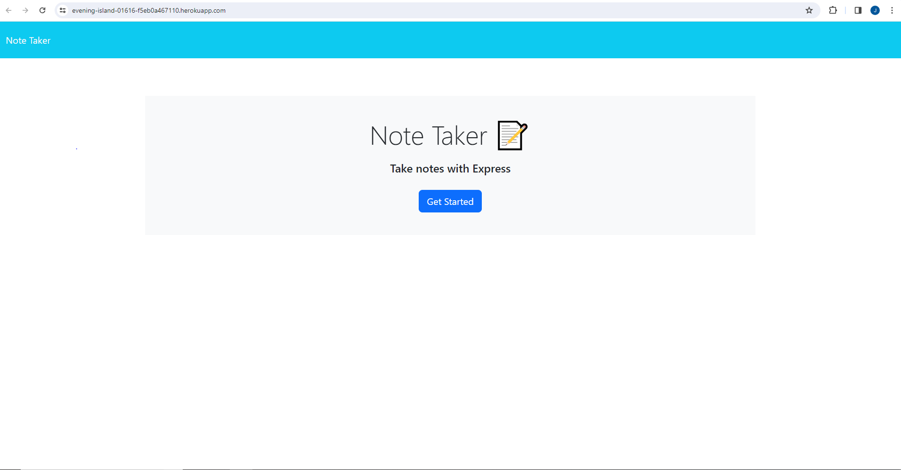
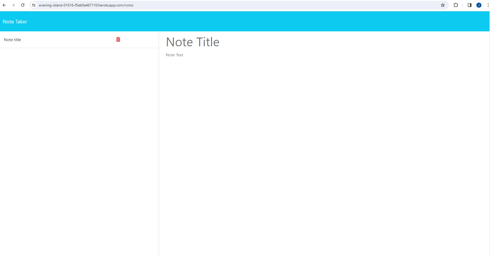

# Description

The goal of this project was to create an application that would enable a user to succinctly take notes to organise and keep track of tasks they have to complete. 

---
### Usage

To use, simply click Get started and, upon being taken to the next page, just enter your note title and note text in the areas that prompt you to do so. 
Doing so will reveal a "save note" button. Click this to save your notes to the side bar. Alternatively, click clear form to abort your current note. 
See the below picture for an overview of the web pages look. 
> Homepage:

> Notes Page

---
### Links

[Click Here](https://evening-island-01616-f5eb0a467110.herokuapp.com/) to follow a link to the deployed application. 
[Click here](https://github.com/JLP-55/Note-Taker) to follow a link to my Github.

---
### Licence

MIT Licence
